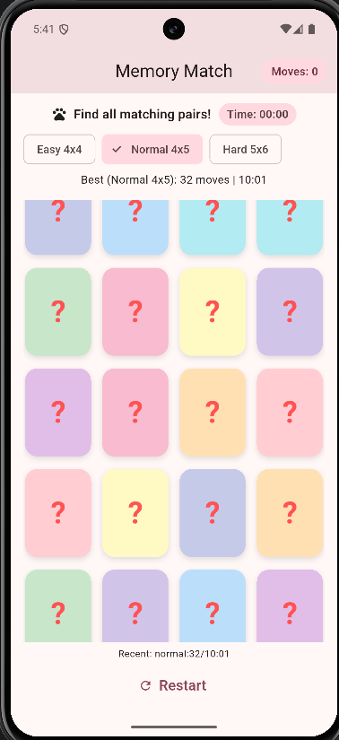
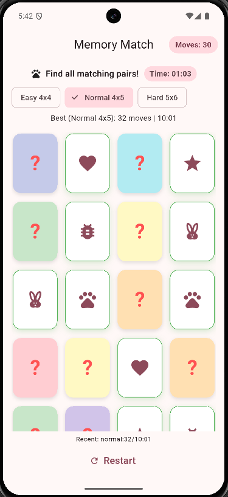
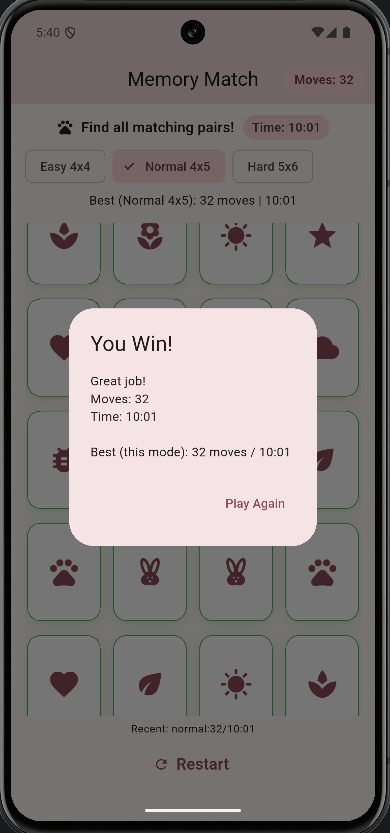

# Memory Match — CS5450 Exercise 2

**Memory Match — Card Matching Game**  
CS5450 Mobile Programming · Exercise 2  
Flutter, Dart, Material 3, Provider  

https://github.com/JuntaoWen/Exercise2

---

## Juntao Wen 1296844

---

## Executive Summary

Memory Match is a local-first memory card game developed as a Flutter project.The app is built with **Dart**, **Flutter**, **Material 3**, and the **Provider** package for state management.

The application delivers a complete matching-game workflow: shuffled boards, flip animations, match and mismatch handling, win detection with a celebration dialog, per-difficulty best records, and persistence across app restarts. Memory Match runs entirely on-device—it.

---

## Challenge Alignment

Memory Match satisfies the expectations through the following implementation choices:

- Cross-platform **Flutter** project using **Dart** and **Material 3**.
- Single polished game screen with difficulty selection, live stats, and restart controls.
- Custom card flip animation using `TweenAnimationBuilder` and 3D Y-axis rotation.
- Professional gameplay flow: shuffle, flip, match, mismatch delay, win dialog, and play-again.
- **Local data persistence** across app restarts via `SharedPreferences`.
- Per-difficulty **best moves** and **best time** tracking plus a rolling **recent results** list.
- Three board sizes: Easy (4×4), Normal (4×5), and Hard (5×6).

---

## Technology Stack

The project uses only technologies present in the repository:

- **Dart** (SDK `>=3.3.0 <4.0.0`)
- **Flutter** (Material Design enabled)
- **provider** ^6.1.2 — `ChangeNotifier` state management
- **shared_preferences** ^2.5.3 — local persistence for stats and recent games
- **flutter_test** and **flutter_lints** — generated Flutter test and lint tooling
- Platform runners: **Android**, **iOS**, **Web**, **Windows**, **Linux**, **macOS**

---

## Feature Overview

### Game Board

The main screen displays a responsive grid of face-down cards. Each card shows a pastel back with a **?** marker. Tapping reveals a Material icon on the front. Matched pairs stay face-up with a green highlight border.

### Flip, Match, And Mismatch Logic

- At most two cards may be face-up at once.
- Matching pair IDs keep both cards revealed and marked as matched.
- Non-matching pairs flip back after a **1-second** delay while input is blocked.
- The move counter increments when the second card of a turn is revealed.

### Timer And Win Detection

- A timer starts on the first card flip of a round.
- When all pairs are matched, the timer stops and a **You Win!** dialog shows moves, elapsed time, and current best records for the active difficulty.
- **Play Again** restarts the board with a fresh shuffle.

### Difficulty Levels

| Mode | Grid | Pairs |
|------|------|-------|
| Easy 4×4 | 4 columns × 4 rows | 8 |
| Normal 4×5 | 4 columns × 5 rows | 10 |
| Hard 5×6 | 5 columns × 6 rows | 15 |

Changing difficulty immediately rebuilds and shuffles the board for the selected size.

### Stats And Persistence

- **Best moves** and **best time** are tracked separately per difficulty.
- Up to **five** recent completed games are stored with difficulty, moves, seconds, and finish timestamp.
- A one-line **Recent** summary appears below the grid when history exists.
- Stats survive app restarts through `SharedPreferences` with defensive JSON parsing.


### Restart

The **Restart** button shuffles a new board, resets moves and timer, and clears the in-progress win state.

---

## Screenshots

### Game Board — Normal Difficulty



Main game screen with 4×5 grid, move counter, timer, and difficulty chips.*

### Card Flip And Match



Face-up matched cards with green highlight and icon pairs visible.*

### Win Dialog



Win dialog showing moves, elapsed time, and best records for the current mode.*

---

## Exact Project Structure

Generated and build output folders such as `.dart_tool/`, `build/`, `.gradle/`, and platform `ephemeral/` directories are intentionally excluded.

```
.
├── .gitignore
├── .metadata
├── README.md
├── README.pdf
├── screenshots
├── analysis_options.yaml
├── pubspec.yaml
├── pubspec.lock
├── test/
│   └── widget_test.dart
├── lib/
│   ├── main.dart
│   ├── models/
│   │   ├── game_result.dart
│   │   └── memory_card_model.dart
│   ├── providers/
│   │   └── game_controller.dart
│   ├── screens/
│   │   └── game_screen.dart
│   └── widgets/
│       └── memory_card.dart
├── android/
│   ├── build.gradle.kts
│   ├── settings.gradle.kts
│   ├── gradle.properties
│   ├── gradlew
│   ├── gradlew.bat
│   └── app/
│       ├── build.gradle.kts
│       └── src/main/
│           ├── AndroidManifest.xml
│           └── kotlin/com/example/memory_match/
│               └── MainActivity.kt
├── ios/
├── linux/
├── macos/
├── web/
└── windows/
```

---

## Configuration And Setup

### Required Software

- **Flutter SDK** compatible with Dart `>=3.3.0 <4.0.0` (see `pubspec.yaml`).
- **Android Studio** or **Visual Studio Code** with Flutter and Dart extensions.
- For Android builds: **Android SDK** and a device emulator or physical phone.
- For Windows desktop builds: **Visual Studio** with Desktop development with C++ workload.
- For iOS/macOS builds: **Xcode** on macOS.

### Flutter And Project Details

| Setting | Value |
|---------|-------|
| Package name | `memory_match` |
| Version | `1.0.0+1` |
| Application ID (Android) | `com.example.memory_match` |
| Entry point | `lib/main.dart` |
| Primary dependencies | `provider`, `shared_preferences` |

---

## Opening In Android Studio Or VS Code

1. Install Flutter and run `flutter doctor` until all required toolchains pass.
2. Open Android Studio (or VS Code) and select **Open**.
3. Choose the full project directory (`Exercise2`).
4. Run `flutter pub get` if dependencies are not yet resolved.
5. Select a target device: Android emulator, physical phone, Windows desktop, or Chrome (web).
6. Press **Run** (or execute `flutter run` from the terminal).

---

## Run Instructions

### Flutter CLI (recommended)

From the project root:

```bash
flutter pub get
flutter run
```

### Release APK (Android)

```bash
flutter build apk --debug
```

Debug APK output:

```
build/app/outputs/flutter-apk/app-debug.apk
```

### Optional device install (Android)

With an emulator or phone connected:

```bash
flutter install
```

### Physical Android Phone Notes

Enable **Developer Options** and **USB debugging**, connect the phone, accept the debugging prompt, and select the device as the Flutter run target.

---


## Software Design And Architecture

Memory Match follows a simple **Provider + ChangeNotifier** architecture:

| Layer | Responsibility |
|-------|----------------|
| `main.dart` | App entry, `MaterialApp` theme, `ChangeNotifierProvider` setup |
| `screens/game_screen.dart` | Scaffold, stats UI, difficulty chips, grid, win dialog, restart |
| `widgets/memory_card.dart` | Card flip animation, front/back presentation |
| `providers/game_controller.dart` | Board shuffle, tap handling, timer, win logic, persistence |
| `models/memory_card_model.dart` | Per-card state: `pairId`, icon, colors, face-up/matched flags |
| `models/game_result.dart` | Serializable record for recent-game history |

**Data flow:**

1. `GameScreen` listens to `GameController` via `Consumer<GameController>`.
2. Card taps call `GameController.onCardTapped(index)`.
3. The controller updates models, notifies listeners, and triggers UI rebuilds.
4. On win, stats are updated in memory and saved asynchronously to `SharedPreferences`.

This separation keeps rendering, game rules, and persistence distinct. The app is reliable for demonstration because all core features run locally without network calls, login, or backend services.
